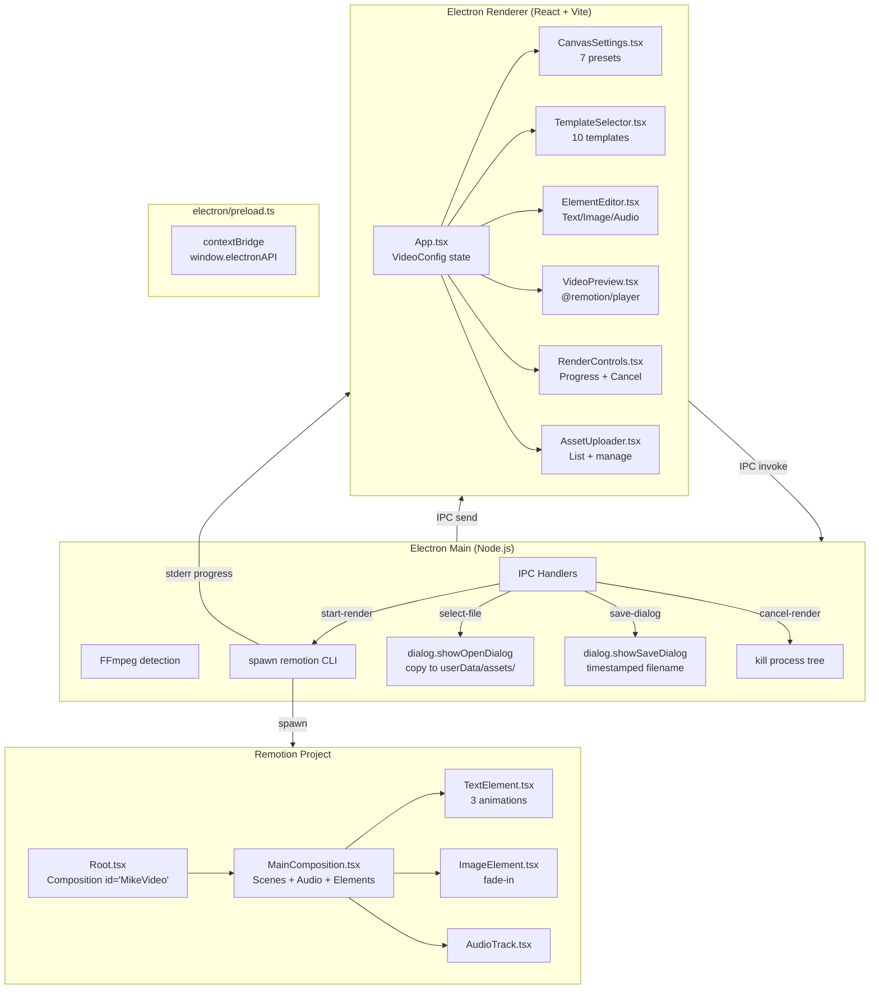

# Mike Video Generator — Project Plan

A Windows desktop application for composing short-form videos with **templates**, **text overlays**, **images**, **background music**, a **live preview**, and **7 canvas presets** — powered by [Remotion](https://remotion.dev) and [Electron](https://www.electronjs.org/).

**Status:** 🟢 Active development — the project is fully scaffolded, all MVP features are implemented, and iteration continues.

---

## Table of Contents

1. [Product Requirements](#1-product-requirements)
2. [User Experience & Workflow](#2-user-experience--workflow)
3. [Architecture](#3-architecture)
4. [Configuration Schema](#4-configuration-schema)
5. [Component Reference](#5-component-reference)
6. [Template System](#6-template-system)
7. [Stock Media Catalog](#7-stock-media-catalog)
8. [Packaging & Distribution](#8-packaging--distribution)
9. [Common Pitfalls & Solutions](#9-common-pitfalls--solutions)

---

## 1. Product Requirements

### 1.1 Implemented Features

| Feature | Status | Details |
|---|---|---|
| Canvas configurator (width, height, FPS, duration, bg color) | ✅ Done | Configurable via number inputs |
| **7 canvas format presets** | ✅ Done | Vertical (9:16), Landscape (16:9), Square (1:1), Portrait (4:5), Cinematic (21:9), Standard (4:3), Short HD (9:16) |
| **10 video templates across 4 categories** | ✅ Done | Branding (3), Product (2), Social (3), Educational (2) |
| Text elements with 3 animation presets | ✅ Done | FadeIn, SlideUp, ScaleIn |
| Image overlays (upload + positioning + opacity + sizing) | ✅ Done | Native file picker via Electron |
| Audio tracks (multiple, loop, volume, trim) | ✅ Done | Multiple simultaneous tracks |
| **Live video preview (Remotion Player)** | ✅ Done | Play/Pause/Seek/Loop in-app |
| **Date-stamped save file names** | ✅ Done | `mike-video_2026-07-26_21-53-43.mp4` |
| Asset upload via native file picker | ✅ Done | Copies to `userData/assets/` |
| MP4 render with progress tracking (bundling + frames) | ✅ Done | 0–100% progress bar, cancel support |
| FFmpeg detection on startup | ✅ Done | Error dialog if missing |
| **Stock media catalog (36 images + 8 audio tracks)** | ✅ Done | picsum.photos + SoundHelix |
| Electron+Remotion integration | ✅ Done | Works over IPC + CLI spawn |

### 1.2 Planned / Future

| Feature | Priority | Notes |
|---|---|---|
| Media Library browser UI | High | Wire `stock-media.ts` into a browseable component with one-click add |
| Drag-and-drop timeline | Medium | Scene reordering, element timeline scrubbing |
| Keyboard shortcuts | Medium | Ctrl+S save, Ctrl+Z undo, Ctrl+Shift+R render |
| Save/load project files | Medium | JSON project persistence |
| Multi-track audio mixing | Low | Volume envelopes, crossfades |
| Video overlays | Low | MP4 clips as visual elements |
| macOS / Linux builds | Low | Requires platform-specific testing |

---

## 2. User Experience & Workflow

### 2.1 User Journey

```
LAUNCH APP
└─> Electron window opens. Templates tab is active.

STEP 1: CHOOSE TEMPLATE (optional)
└─> 10 template cards shown. Each shows name, category, duration, description, preview color.
└─> User clicks a template → canvas + elements are populated with placeholder content.
└─> App auto-switches to Elements tab for editing.

STEP 2: CONFIGURE CANVAS
└─> Switch to Canvas tab.
└─> Click "Presets" to reveal 7 format presets. Click one → dimensions update.
└─> Or type custom width/height, adjust FPS, duration, and background color.

STEP 3: EDIT ELEMENTS
└─> Switch to Elements tab.
└─> Click text elements to edit text content, font, size, color, position, animation.
└─> Click "Add Text" to create a new text overlay.
└─> Click "Add Image" → native file picker opens → image appears in list.
└─> Click "Add Audio" → file picker → audio track appears with volume/timing controls.
└─> Watch the live preview (right panel) update in real-time.

STEP 4: PREVIEW
└─> Click the play button in the header to toggle the preview panel.
└─> Click play on the preview to watch the full video with all animations.
└─> Scrub the timeline to inspect specific frames.

STEP 5: RENDER
└─> Click "Render MP4" button.
└─> Save dialog appears with timestamped filename: mike-video_2026-07-26_21-53-43.mp4
└─> Progress bar shows bundling (0–10%) then rendering frames (10–100%).
└─> Render completes. Success state shows output path.
└─> Or click "Cancel" to abort mid-render.
```

### 2.2 UI State Machine

| State | Renderer UI | Main Process |
|---|---|---|
| `IDLE` | All inputs editable. Render button active. | Waiting for IPC. |
| `VALIDATING` | "Preparing assets..." spinner. | Copies assets to temp dir, writes props JSON. |
| `RENDERING` | Progress bar (0–100%). Cancel button shown. | `spawn` active. Parsing stderr for progress. |
| `SUCCESS` | Output path displayed. "Render" available again. | Process exited code 0. |
| `ERROR` | Red error box with stderr tail. | Process exited non-zero. |

### 2.3 App Layout

```
┌──────────────────────────────────────────────────────────────┐
│  Header: [Logo] Mike Video Generator   [Preview toggle] [Render] │
│          1080×1920 · 15s · 8 elements · 1 track                │
├──────┬────────────────────────────────────┬──────────────────┤
│      │                                    │                  │
│ Side │  Content Panel                     │  Preview Panel   │
│ bar  │  [Templates] [Canvas] [Elements]   │  (toggleable)    │
│      │  [Assets]                          │  ┌──────────┐   │
│      │                                    │  │ ▶ Play   │   │
│      │  Active tab renders here           │  │ ░░░░░░░  │   │
│      │                                    │  │ 42/450   │   │
│      │                                    │  └──────────┘   │
│      │                                    │                  │
├──────┴────────────────────────────────────┴──────────────────┤
│  Status bar (implicit)                                       │
└──────────────────────────────────────────────────────────────┘
```

---

## 3. Architecture

### 3.1 System Overview



### 3.2 Directory Layout

```
mike-video-generator/
├── electron/
│   ├── main.ts               # App lifecycle, IPC handlers, FFmpeg check, Remotion spawn
│   ├── preload.ts             # contextBridge — typed API surface
│   └── vite.config.ts         # Electron Vite config
│
├── gui/
│   ├── src/
│   │   ├── main.tsx           # React entry point + CSS variables (dark theme)
│   │   ├── App.tsx            # Root — VideoConfig state, tabs, layout
│   │   ├── components/
│   │   │   ├── CanvasSettings.tsx    # Canvas config + 7-format preset grid
│   │   │   ├── ElementEditor.tsx     # Text/Image/Audio CRUD
│   │   │   ├── AssetUploader.tsx     # Uploaded asset manager
│   │   │   ├── RenderControls.tsx    # Render button, progress bar, cancel, output
│   │   │   ├── TemplateSelector.tsx  # Template catalog (10 cards)
│   │   │   └── VideoPreview.tsx      # Live @remotion/player panel
│   │   ├── templates/
│   │   │   ├── index.ts             # TEMPLATES array (registry)
│   │   │   ├── helpers.ts           # Shared txt() helper
│   │   │   ├── brand-story.ts
│   │   │   ├── feature-showcase.ts
│   │   │   ├── quick-announcement.ts
│   │   │   ├── tips-listicle.ts
│   │   │   ├── sales-pitch.ts
│   │   │   ├── event-countdown.ts
│   │   │   ├── how-to-tutorial.ts
│   │   │   ├── team-intro.ts
│   │   │   ├── year-in-review.ts
│   │   │   └── holiday-greeting.ts
│   │   ├── data/
│   │   │   └── stock-media.ts       # 36 images + 8 audio tracks (categorized)
│   │   └── hooks/
│   │       └── useElectron.ts       # Typed React wrapper for electronAPI
│   └── index.html
│
├── remotion/
│   ├── index.tsx              # registerRoot(Root)
│   ├── Root.tsx               # <Composition id="MikeVideo" ...>
│   ├── types.ts               # Re-exports from shared/VideoConfig.ts
│   ├── compositions/
│   │   └── MainComposition.tsx # Scene backgrounds, Audio, Text/Image elements
│   └── components/
│       ├── TextElement.tsx     # Animated text (fadeIn, slideUp, scaleIn)
│       ├── ImageElement.tsx    # Image overlay (fade-in, objectFit)
│       └── AudioTrack.tsx     # <Audio> wrapper
│
├── shared/
│   └── VideoConfig.ts          # Single source-of-truth — types, defaults, ElectronAPI
│
├── out/
│   ├── main/index.js          # Built main process
│   └── renderer/              # Built renderer bundle
│
├── package.json
├── electron.vite.config.ts
└── remotion.config.ts
```

### 3.3 IPC Communication

The preload script exposes a typed API via `contextBridge`:

| Channel | Direction | Payload | Purpose |
|---|---|---|---|
| `select-file` | Renderer → Main | `FileFilter[]` | Open native file picker, copy to `userData/assets/` |
| `save-dialog` | Renderer → Main | `string?` (defaultName) | Open save dialog, returns chosen path |
| `start-render` | Renderer → Main | `(VideoConfig, outputPath)` | Begin video render |
| `cancel-render` | Renderer → Main | — | Kill active render + process tree |
| `render-progress` | Main → Renderer | `number` (0–100) | Bundling (0–10%) or frame progress (10–100%) |
| `render-complete` | Main → Renderer | `string` (outputPath) | Render finished successfully |
| `render-error` | Main → Renderer | `string` (error details) | Render failed |

### 3.4 ElectronAPI Surface (Typed)

```typescript
interface ElectronAPI {
  selectFile: (filters?: FileFilter[]) => Promise<string | null>;
  saveDialog: (defaultName?: string) => Promise<string | null>;
  startRender: (config: VideoConfig, outputPath: string) => Promise<void>;
  cancelRender: () => Promise<void>;
  onRenderProgress: (callback: (percent: number) => void) => void;
  onRenderComplete: (callback: (outputPath: string) => void) => void;
  onRenderError: (callback: (error: string) => void) => void;
  removeAllListeners: (channel: string) => void;
}
```

---

## 4. Configuration Schema

The JSON schema below is the **single source of truth** — the GUI builds it, the Main process writes it to disk, and Remotion consumes it via the `--props` flag.

```typescript
// shared/VideoConfig.ts

export interface VideoConfig {
  version: "1.0";
  canvas: {
    width: number;            // e.g., 1080
    height: number;           // e.g., 1920
    fps: number;              // e.g., 30
    durationInFrames: number; // fps × durationSeconds
    backgroundColor: string;  // hex fallback, e.g., "#0a0a0a"
    scenes?: SceneBackground[]; // optional multi-scene backgrounds
  };
  tracks: {
    audio: AudioTrack[];
    elements: VisualElement[];
  };
}

export interface SceneBackground {
  from: number;      // Start frame index
  color: string;     // Background color for this scene segment
}

export interface AudioTrack {
  id: string;
  src: string;                // Absolute file path or URL
  from: number;               // Start frame
  durationInFrames: number;
  volume?: number;            // 0.0–1.0 (default 1)
  loop?: boolean;             // Loop playback
  trimBefore?: number;        // Frames to trim from start
  trimAfter?: number;         // Frames to trim from end
}

export type VisualElement = TextElement | ImageElement;

export interface BaseElement {
  id: string;
  from: number;
  durationInFrames: number;
  position: { x: number; y: number };
  opacity?: number;
}

export interface TextElement extends BaseElement {
  type: "text";
  text: string;               // Supports \n (pre-wrap)
  style: {
    fontSize: number;
    color: string;
    fontFamily: string;       // e.g., "Arial, sans-serif"
    fontWeight?: number;
    textAlign?: "left" | "center" | "right";
  };
  animation?: {
    type: "fadeIn" | "slideUp" | "scaleIn";
    durationInFrames: number; // e.g., 30 frames
  };
}

export interface ImageElement extends BaseElement {
  type: "image";
  src: string;                // Absolute file path
  size?: {
    width?: number;
    height?: number;
    objectFit?: "cover" | "contain" | "fill";
  };
}
```

### 4.1 Default Config

```typescript
export const DEFAULT_CONFIG: VideoConfig = {
  version: "1.0",
  canvas: {
    width: 1080,
    height: 1920,
    fps: 30,
    durationInFrames: 450,    // 15 seconds
    backgroundColor: "#0a0a0a",
  },
  tracks: {
    audio: [],
    elements: [],
  },
};
```

### 4.2 UI State Type

```typescript
export type RenderState = "IDLE" | "VALIDATING" | "RENDERING" | "SUCCESS" | "ERROR";
```

---

## 5. Component Reference

### 5.1 CanvasSettings

**File:** `gui/src/components/CanvasSettings.tsx`

Canvas configuration panel with:
- **Width / Height** number inputs (locked aspect ratio is not enforced — fully independent)
- **FPS** input (default 30)
- **Duration** input in seconds (converted to frames internally, clamped 1–600s)
- **Background Color** hex color picker
- **Preset toggle** — reveals a grid of 7 format presets, each with icon, aspect ratio, resolution, and description
- **PresetCardBtn** — a memoized sub-component with React `useState` for hover highlighting (consistent with TemplateSelector pattern)
- Active preset detection by matching width + height exactly
- Presets only set width/height/duration — FPS and background color are preserved
- Info box shows current resolution, aspect ratio, orientation, and total frame count

### 5.2 ElementEditor

**File:** `gui/src/components/ElementEditor.tsx`

Element CRUD interface:
- Filter chips to switch between **Text**, **Image**, and **Audio** views
- **Add Text** button — creates a new TextElement with default values
- **Add Image** button — triggers native file picker, creates ImageElement
- **Add Audio** button — triggers native file picker, creates AudioTrack
- Each element type has a dedicated card with configurable fields:
  - **Text:** Content, font size, color, font family, weight, alignment, position X/Y, start time, duration, animation type + duration
  - **Image:** Source path, position X/Y, width, height, object fit, opacity, start time, duration
  - **Audio:** Source path, volume slider, loop checkbox, trim start/end (in seconds), start time
- **Remove** button on each element
- All time values are displayed in seconds and converted to frames internally

### 5.3 AssetUploader

**File:** `gui/src/components/AssetUploader.tsx`

Asset management panel:
- Lists all current images and audio tracks
- Shows thumbnails for images with source path, dimensions, and opacity
- Shows audio tracks with source path, volume, and loop status
- Add buttons for images and audio (same as ElementEditor)
- Remove buttons for each asset
- Inline editing for opacity, volume, loop, and position

### 5.4 RenderControls

**File:** `gui/src/components/RenderControls.tsx`

Render lifecycle control:
- **Render MP4** button (active only in `IDLE` and `SUCCESS` states)
- Progress bar with percentage label
- **Cancel** button (visible during `VALIDATING` and `RENDERING`)
- **Output path** display on success (clickable)
- **Error details** box on failure (scrollable stderr)
- State transitions: IDLE → VALIDATING → RENDERING → SUCCESS/ERROR → IDLE

### 5.5 TemplateSelector

**File:** `gui/src/components/TemplateSelector.tsx`

Template catalog:
- Displays 10 template cards in a responsive grid
- Each card shows: icon, name, category badge (colored), duration badge, description, and hover accent border
- Category filter chips (All, Branding, Product, Social, Educational) with active state
- Clicking a template calls `onSelectTemplate(template.generate())` which populates the full VideoConfig
- Loading state with skeleton shimmer animation
- Empty state when no templates match the selected category
- Smooth card entrance animations on mount

### 5.6 VideoPreview

**File:** `gui/src/components/VideoPreview.tsx`

Live video preview panel using `@remotion/player`:
- Toggle visibility via the play button in the header
- Panel header shows "Preview" title and current resolution badge
- `<Player>` component renders `MainComposition` directly with the current `VideoConfig` as `inputProps`
- Smart sizing: portrait videos get a phone-like frame (70% max-width), landscape fills the panel
- `aspectRatio` CSS property ensures perfect proportions
- Play/Pause button, timeline seek bar, and loop toggle
- Auto-scales to fit the panel (no scrollbars)
- Dark preview background (#08080a)
- Info bar shows current frame, FPS, and total duration

### 5.7 MainComposition (Remotion)

**File:** `remotion/compositions/MainComposition.tsx`

Root composition that renders the full video:
- **Scene backgrounds** — iterates `canvas.scenes[]` and wraps each in a `<Sequence>` with the scene's color. Falls back to a single `AbsoluteFill` with `canvas.backgroundColor` if no scenes are defined.
- **Audio tracks** — maps `tracks.audio[]` to `<AudioTrackComponent>` components
- **Visual elements** — maps `tracks.elements[]` to `<Sequence>` wrappers containing `<TextElement>` or `<ImageElement>`
- All elements are positioned absolutely within the 1080×1920 (or custom) canvas

### 5.8 TextElement (Remotion)

**File:** `remotion/components/TextElement.tsx`

Animated text overlay with `useCurrentFrame()` and `interpolate()`:

| Animation | Effect |
|---|---|
| `fadeIn` | Opacity 0 → 1 over `durationInFrames` |
| `slideUp` | TranslateY 50px → 0 + opacity 0 → 1 |
| `scaleIn` | Scale 0.5 → 1 + opacity 0 → 1 |

- Falls back to static rendering (full opacity, identity transform) when frame exceeds animation duration
- Supports multiline text via `white-space: pre-wrap`
- Max-width 80% with `word-break: break-word`
- Line height 1.2

### 5.9 ImageElement (Remotion)

**File:** `remotion/components/ImageElement.tsx`

Image overlay with:
- Absolute positioning at `position.x` / `position.y`
- Configurable width/height and `objectFit` (cover, contain, fill)
- Simple fade-in over first 15 frames
- Fallback placeholder ("No image") when `src` is empty

### 5.10 AudioTrack (Remotion)

**File:** `remotion/components/AudioTrack.tsx`

Simple `Audio` component wrapper:
- Passes `src`, `startFrom` (trimBefore), `endAt` (trimAfter), and `volume` directly to Remotion's `<Audio>`
- Uses `remotion` package's `<Audio>` (not `@remotion/media`)

---

## 6. Template System

### 6.1 VideoTemplate Interface

```typescript
export interface VideoTemplate {
  id: string;
  name: string;
  description: string;
  duration: number; // seconds
  category: "Branding" | "Product" | "Social" | "Educational";
  color: string; // preview card color
  icon: string; // emoji for the card
  generate: (overrides?: Record<string, string>) => VideoConfig;
}
```

### 6.2 Template Registry

All templates are registered in `gui/src/templates/index.ts` and exported as the `TEMPLATES` array. TemplateSelector iterates this array to render cards.

### 6.3 Shared Helper

**File:** `gui/src/templates/helpers.ts`

```typescript
function txt(
  id: string,
  text: string,
  from: number,
  durationInFrames: number,
  x: number,
  y: number,
  overrides?: Partial<TextElement>
): TextElement
```

All templates use `txt()` to consistently generate `TextElement` objects with sensible defaults (fontSize: 72, color: "#ffffff", fontFamily: "Arial, sans-serif", textAlign: "center", animation: slideUp 30 frames).

### 6.4 Template Catalog

| # | Template | Duration | Category | Override Fields | Scenes | Key Features |
|---|---|---|---|---|---|---|
| 1 | **Brand Story** | 60s | Branding | headline, problem, solution, result, cta | 5 | Value props, results, CTA |
| 2 | **Feature Showcase** | 45s | Product | productName, feature1, feature2, feature3, cta | 4 | 3 features with bold stats |
| 3 | **Quick Announcement** | 30s | Social | headline, message, date, cta, tagline | 4 | High-energy, punchy CTAs |
| 4 | **Tips & Listicle** | 60s | Educational | topic, tip1, tip2, tip3, tip4 | 4 | 4 numbered tips with quotes |
| 5 | **Sales Pitch** | 60s | Product | headline, challenge, solution, testimonial, client, role, cta | 5 | Quote cards, trust signals, testimonial |
| 6 | **Event Countdown** | 45s | Social | eventName, date, time, location, speaker1-4, cta | 5 | Countdown, speakers, registration |
| 7 | **How-To Tutorial** | 90s | Educational | topic, step1-5, tip | 5 | 5 numbered steps, progress, recap |
| 8 | **Team Introduction** | 45s | Branding | company, mission, value1-3, member1-3 | 5 | Values, team spotlights, perks |
| 9 | **Year in Review** | 60s | Branding | year, stat1-3, milestone1-2, highlight | 5 | Big stats, milestones, impact |
| 10 | **Holiday Greeting** | 30s | Social | recipient, message, gratitude, wish | 4 | Festive, warm seasonal greeting |

### 6.5 Adding a New Template

1. Create `gui/src/templates/my-template.ts`
2. Import `txt` from `./helpers`
3. Export a `VideoTemplate` object with `id`, `name`, `description`, `duration`, `category`, `color`, `icon`, and `generate()` method
4. Import and add to the `TEMPLATES` array in `gui/src/templates/index.ts`

The `generate()` method returns a fully-populated `VideoConfig` with placeholder text. Each text element should use `txt()` for consistency.

---

## 7. Stock Media Catalog

**File:** `gui/src/data/stock-media.ts`

A curated catalog of free stock media for video composition. Images use [picsum.photos](https://picsum.photos) (free, no API key). Audio uses [SoundHelix](https://www.soundhelix.com/) (CC BY 3.0).

### 7.1 Types

```typescript
interface StockImage {
  id: string;
  title: string;
  category: ImageCategory;  // backgrounds | nature | business | technology | abstract | city | people
  url: string;              // Full-res image URL
  thumbUrl: string;         // Thumbnail URL (400×600)
  attribution?: string;     // Optional attribution
  tags: string[];
}

interface StockAudio {
  id: string;
  title: string;
  category: AudioCategory;  // background | corporate | upbeat | calm | cinematic
  url: string;              // MP3 URL
  duration: string;         // e.g., "5:14"
  mood: string;             // e.g., "Inspiring", "Calm"
  attribution: string;
}
```

### 7.2 Media Counts

| Image Category | Count |
|---|---|
| Backgrounds | 6 |
| Nature | 6 |
| Business | 6 |
| Technology | 6 |
| Abstract | 4 |
| City | 4 |
| People | 4 |
| **Total** | **36** |

| Audio Category | Count |
|---|---|
| Background | 2 |
| Corporate | 1 |
| Upbeat | 2 |
| Calm | 2 |
| Cinematic | 1 |
| **Total** | **8** |

### 7.3 UI Grouping

Pre-built category arrays for rendering:

```typescript
IMAGE_CATEGORIES: MediaCategory<StockImage>[]
AUDIO_CATEGORIES: MediaCategory<StockAudio>[]
```

Each contains `{ id, label, icon, items }` ready to render as filter tabs or section headers.

---

## 8. Packaging & Distribution

### 8.1 Electron Builder Configuration

From `package.json`:

```json
{
  "build": {
    "appId": "com.mike.videogenerator",
    "productName": "Mike Video Generator",
    "directories": { "output": "release" },
    "files": [
      "out/**/*",
      "remotion/**/*",
      "shared/**/*",
      "node_modules/**/*"
    ],
    "win": { "target": "nsis", "icon": "build/icon.ico" },
    "nsis": {
      "oneClick": false,
      "allowToChangeInstallationDirectory": true
    }
  }
}
```

> **Important:** `remotion/` and `shared/` directories are included in `build.files` so the packaged app can find them at runtime.

### 8.2 Build Commands

```bash
npm run dev            # Development mode (Electron + Vite hot reload)
npm run build          # Production build (Electron + Renderer + Remotion)
npm run dist           # Package Windows NSIS installer
npm run preview        # Electron Vite preview (serve built output)
npm run remotion:preview  # Standalone Remotion Studio for template development
npm run remotion:render   # CLI render (for testing without GUI)
```

### 8.3 FFmpeg Requirement

The app checks for FFmpeg on startup. If not found in PATH, an error dialog is shown and the app exits. Remotion requires FFmpeg for video encoding.

### 8.4 Pre-Release Checklist

- [ ] `remotion/index.tsx` registers the `Root` component
- [ ] `Root.tsx` defines the `"MikeVideo"` composition
- [ ] `remotion/` and `shared/` are listed in `electron-builder`'s `build.files`
- [ ] `preload.ts` exposes exactly the API the renderer expects
- [ ] FFmpeg detection works in the packaged environment
- [ ] `out/` directory is clean before building (`electron-vite build` clears it)
- [ ] All 10 templates generate valid `VideoConfig` objects
- [ ] Render progress regex matches the installed Remotion version's output format

---

## 9. Common Pitfalls & Solutions

| Bug | Root Cause | Prevention |
|---|---|---|
| **Remotion can't find assets** | Absolute paths with backslashes break JSON or Remotion's URL parser | Always copy assets to temp dir and use `path.join()` (normalizes separators) |
| **FFmpeg not found in packaged app** | Remotion requires FFmpeg in PATH; users don't have it | Check on startup. Consider bundling `ffmpeg-static` |
| **"Could not find composition"** | Composition ID mismatch between CLI args and `Root.tsx` | Hardcode `"MikeVideo"` everywhere. Only one composition in Root |
| **Progress bar stuck at 0%** | Parsing wrong output stream or regex doesn't match Remotion version | Remotion logs progress to **stderr**. Use `--log=verbose` to ensure format is visible |
| **White screen after packaging** | Vite build paths incorrect in production | Use `__dirname` resolution in main process |
| **Audio out of sync / missing** | `<Audio>` imported from wrong module | Use `remotion`'s `<Audio>` (not `@remotion/media` in recent versions) |
| **Images don't appear** | Using `staticFile()` for user-uploaded files outside `public/` | Pass absolute `file://` paths directly to ``. Only use `staticFile()` for built-in assets |
| **Save path with special characters** | Greek/spaced paths break shell spawning | Pass `--props` as a separate arg, not concatenated. Use `shell: true` on Windows |
| **Render process orphaned on crash** | Child process not killed when Electron exits | Track `activeRenderProcess` and kill in `before-quit` handler + Windows `taskkill /T` |
| **Date-stamped filename wrong** | Extension parsed incorrectly | Use `path.extname()` + `path.basename()` for reliable filename parsing |
